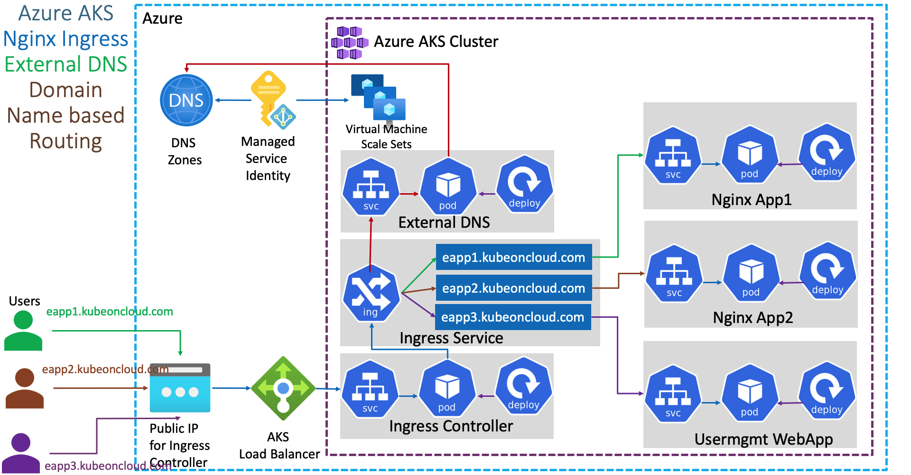

# Ingress - Domain Name Based Routing

## Step-01: Introduction
- We are going to implement Domain Name based routing using Ingress
- We are going to use 3 applications for this.



## Step-02: Review k8s Application Manifests
- App1 Manifests
- App2 Manifests
- App3 Manifests

## Step-03: Review Ingress Service Manifests
- 01-Ingress-DomainName-Based-Routing-app1-2-3.yml


## Step-04: Deploy and Verify
```t
# Deploy Apps
kubectl apply -R -f kube-manifests/

# List Pods
kubectl get pods

# List Services
kubectl get svc

# List Ingress
kubectl get ingress

# Verify Ingress Controller Logs
kubectl get pods -n ingress-basic
kubectl logs -f <pod-name> -n ingress-basic

# Verify External DNS pod to ensure record set got deleted
kubectl logs -f $(kubectl get po | egrep -o 'external-dns[A-Za-z0-9-]+')


# Verify Record set got automatically deleted in DNS Zones
# Template Command
az network dns record-set a list -g <Resource-Group-dnz-zones> -z <yourdomain.com>

# Replace DNS Zones Resource Group and yourdomain
az network dns record-set a list -g dns-zones -z kubeoncloud.com
```

## Step-05: Access Applications
```t
# Access App1
http://eapp1.kubeoncloud.com/app1/index.html

# Access App2
http://eapp2.kubeoncloud.com/app2/index.html

# Access Usermgmt Web App
http://eapp3.kubeoncloud.com
Username: admin101
Password: password101

```

## Step-06: Clean-Up Applications
```t
# Delete Apps
kubectl delete -R -f kube-manifests/

# Verify Record set got automatically deleted in DNS Zones
# Template Command
az network dns record-set a list -g <Resource-Group-dnz-zones> -z <yourdomain.com>

# Replace DNS Zones Resource Group and yourdomain
az network dns record-set a list -g dns-zones -z kubeoncloud.com
```

## Ingress Annotation Reference
- https://kubernetes.github.io/ingress-nginx/user-guide/nginx-configuration/annotations/

## Other References
- https://docs.nginx.com/nginx-ingress-controller/

