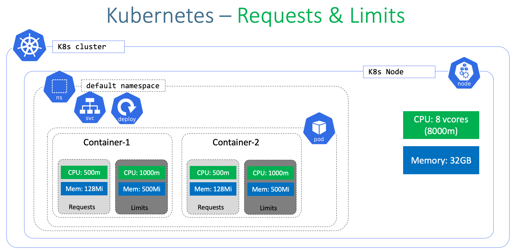

# Kubernetes - Requests and Limits

## Step-01: Introduction
- We can specify how much each container in a pod needs the resources like CPU & Memory. 
- When we provide this information in our pod, the scheduler uses this information to decide which node to place the Pod on based on availability of k8s worker Node CPU and Memory Resources. 
- When you specify a resource limit for a Container, the kubelet enforces those `limits` so that the running container is not allowed to use more of that resource than the limit you set. 
-  The kubelet also reserves at least the `request` amount of that system resource specifically for that container to use.

 

## Pre-requisite Check (Optional)
- We should already have our AKS Cluster UP and Running. 
- We should have configured our AKS Cluster credentials in command line to execute `kubectl` commands
```
# Configure AKS Cluster Credentials from command line
az aks get-credentials --name aksdemo1 --resource-group aks-rg1

# List Worker Nodes
kubectl get nodes
kubectl get nodes -o wide
```


## Step-02: Add Requests & Limits & Review k8s Manifests
- **Folder:** kube-manifests-v1
```yaml
          # Requests & Limits    
          resources:
            requests:
              cpu: "100m" 
              memory: "128Mi"
            limits:
              cpu: "200m"
              memory: "256Mi"                                                         
```

## Step-03: Create k8s objects & Test
```
# Create All Objects
kubectl apply -f kube-manifests-v1/

# List Pods
kubectl get pods

# List Services
kubectl get svc

# Access Application 
http://<Public-IP-from-List-Services-Output>/app1/index.html
```
## Step-04: Clean-Up
- Delete all k8s objects created as part of this section
```
# Delete All
kubectl delete -f kube-manifests-v1/
```

## Step-05: Assignment
- You can deploy and test `kube-manifests-v2`
- Verify the `Resources` section in file `05-UserMgmtWebApp-Deployment.yml` before deploying
```
# Create All Objects
kubectl apply -f kube-manifests-v2/

# List Pods
kubectl get pods

# List Services
kubectl get svc

# Access Application 
http://<Public-IP-from-List-Services-Output>
Username: admin101
Password: password101

# Clean-Up
kubectl delete -f kube-manifests-v2/
```


## References:
- https://kubernetes.io/docs/concepts/configuration/manage-resources-containers/
