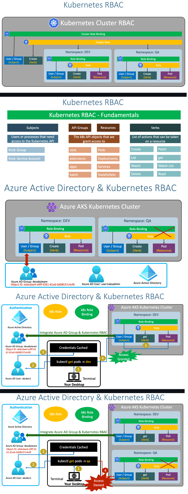
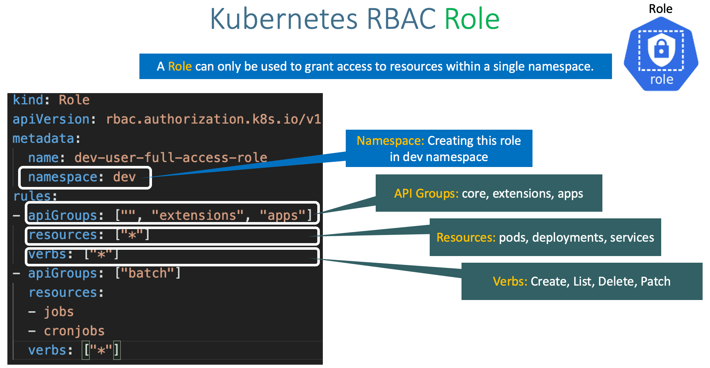
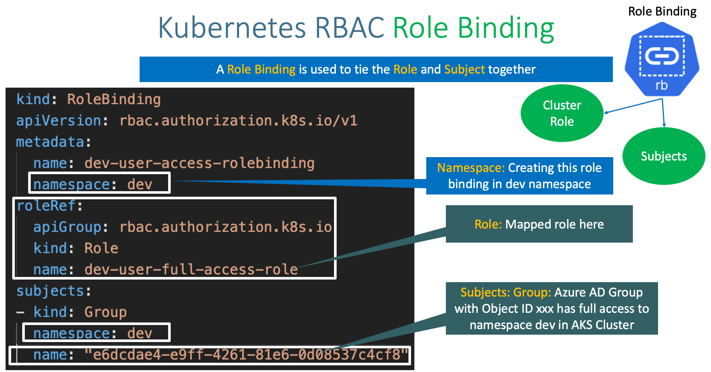

# Kubernetes RBAC Role & Role Binding with Azure AD on AKS

## Step-01: Introduction
- AKS can be configured to use Azure AD for Authentication which we have seen in our previous section
- In addition, we can also configure Kubernetes role-based access control (RBAC) to limit access to cluster resources based a user's identity or group membership.
- Understand about Kubernetes RBAC Role & Role Binding




## Step-02: Create a Namespace Dev, QA and Deploy Sample Application
```
# Configure Command Line Credentials for kubectl
az aks get-credentials --name aksdemo3 --resource-group aks-rg3 --admin

# View Cluster Info
kubectl cluster-info

# Create Namespaces dev and qa
kubectl create namespace dev
kubectl create namespace qa

# List Namespaces
kubectl get namespaces

# Deploy Sample Application
kubectl apply -f kube-manifests/01-Sample-Application -n dev
kubectl apply -f kube-manifests/01-Sample-Application -n qa

# Access Dev Application
kubectl get svc -n dev
http://<public-ip>/app1/index.html

# Access Dev Application
kubectl get svc -n qa
http://<public-ip>/app1/index.html
```

## Step-03: Create AD Group, Role Assignment and User for Dev 
```
# Get Azure AKS Cluster Id
AKS_CLUSTER_ID=$(az aks show --resource-group aks-rg3 --name aksdemo3 --query id -o tsv)
echo $AKS_CLUSTER_ID

# Create Azure AD Group
DEV_AKS_GROUP_ID=$(az ad group create --display-name devaksteam --mail-nickname devaksteam --query objectId -o tsv)    
echo $DEV_AKS_GROUP_ID

# Create Role Assignment 
az role assignment create \
  --assignee $DEV_AKS_GROUP_ID \
  --role "Azure Kubernetes Service Cluster User Role" \
  --scope $AKS_CLUSTER_ID

# Create Dev User
DEV_AKS_USER_OBJECT_ID=$(az ad user create \
  --display-name "AKS Dev1" \
  --user-principal-name aksdev1@ashwinbittugmail.onmicrosoft.com \
  --password @AKSDemo123 \
  --query objectId -o tsv)
echo $DEV_AKS_USER_OBJECT_ID  

# Associate Dev User to Dev AKS Group
az ad group member add --group devaksteam --member-id $DEV_AKS_USER_OBJECT_ID
```

## Step-04: Test Dev User Authentication to Portal
- URL: https://portal.azure.com
- Username: aksdev1@ashwinbittugmail.onmicrosoft.com
- Password: @AKSDemo123


## Step-05: Review Kubernetes RBAC Role & Role Binding
### Kubernetes RBAC Role for Dev Namespace
- **File Name:** role-dev-namespace.yaml
```yaml
kind: Role
apiVersion: rbac.authorization.k8s.io/v1
metadata:
  name: dev-user-full-access-role
  namespace: dev
rules:
- apiGroups: ["", "extensions", "apps"]
  resources: ["*"]
  verbs: ["*"]
- apiGroups: ["batch"]
  resources:
  - jobs
  - cronjobs
  verbs: ["*"]
```
### Get Object Id for devaksteam AD Group
```
# Get Object ID for AD Group devaksteam
az ad group show --group devaksteam --query objectId -o tsv

# Output
e6dcdae4-e9ff-4261-81e6-0d08537c4cf8
```



### Review & Update Kubernetes RBAC Role Binding for Dev Namespace
- Update Azure AD Group **devaksteam** Object ID in Role Binding
- **File Name:** rolebinding-dev-namespace.yaml
```yaml
kind: RoleBinding
apiVersion: rbac.authorization.k8s.io/v1
metadata:
  name: dev-user-access-rolebinding
  namespace: dev
roleRef:
  apiGroup: rbac.authorization.k8s.io
  kind: Role
  name: dev-user-full-access-role
subjects:
- kind: Group
  namespace: dev
  #name: groupObjectId
  name: "e6dcdae4-e9ff-4261-81e6-0d08537c4cf8"  
```




## Step-06: Create Kubernetes RBAC Role & Role Binding for Dev Namespace
```
# As AKS Cluster Admin (--admin)
az aks get-credentials --resource-group aks-rg3 --name aksdemo3 --admin

# Create Kubernetes Role and Role Binding
kubectl apply -f kube-manifests/02-Roles-and-RoleBindings

# Verify Role and Role Binding
kubectl get role -n dev
kubectl get rolebinding -n dev
```

## Step-07: Access Dev Namespace using aksdev1 AD User
```
# Overwrite kubectl credentials
az aks get-credentials --resource-group aks-rg3 --name aksdemo3 --overwrite-existing

# List Pods 
kubectl get pods -n dev
- URL: https://microsoft.com/devicelogin
- Code: GLUQPEQ2N (Sample)(View on terminal)
- Username: aksdev1@ashwinbittugmail.onmicrosoft.com
- Password: @AKSDemo123

# List Services from Dev Namespace
kubectl get svc -n dev

# List Services from QA Namespace
kubectl get svc -n qa

# Forbidden Message should come when we list QA Namespace resources
Error from server (Forbidden): services is forbidden: User "aksdev1@ashwinbittugmail.onmicrosoft.com" cannot list resource "services" in API group "" in the namespace "qa"
```

## Step-08: Clean-Up
```
# Clean-Up Apps
kubectl delete ns dev
kubectl delete ns qa
```

